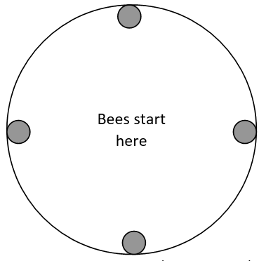

```{r setup, include=FALSE}
library(tidyverse)
library(gridExtra)
knitr::opts_chunk$set(echo = TRUE)
```

## Introduction

Welcome to the "Burrowing Bees" assignment. 
Penny Kukuk, a biologist at UM, performed the following experiment. Four adult female bees of an 
Australian species that builds its hives underground (Lasioglossum hemichalceum) were placed in 
a circular container with a smooth uniform surface of dirt with four indentations placed at the 
edge of the circle 90 degrees apart.


The bees instinctively would burrow into the indentations (I’ll call the indentations “holes” for short). 
Sometimes more than one bee would burrow into the same hole leaving some holes empty. After all the bees 
had burrowed into the holes, the pattern of bee occupancy was observed. This experiment was repeated 
37 times with different bees each time.

```{r results-table}
res <- tibble(pattern=c("4,0,0,0","3,1,0,0","2,2,0,0","2,1,1,0","1,1,1,1"),
              count=c(4,4,5,17,7)) %>% 
  mutate(portion=count/sum(count))

knitr::kable(res,digits=3,colnames=c("Pattern","Count","Portion"))


```

The biologist was interested in whether the bees appear to choose holes independently of 
each other (the alternative is that they tend to either choose holes in which there already 
is a bee or tend to avoid holes in which there already is a bee or both). Therefore, we want 
to calculate the probability of each pattern if each bee chose a hole randomly and independently of the other bees.

Note that, as far as the biologist is concerned, the holes are indistinguishable and the bees 
are indistinguishable. For instance, the pattern “3,1,0,0” means that 3 bees ended up in one of 
the holes and 1 in another; the specific holes don't matter, nor do the specific bees. 

## Goal

Let’s use a simulation to estimate if the bees are behaving randomly. 
In order to do this, you will need to write code that simulates a 
certain number of trials (which can be user determined).

The following steps are a guideline; there are many ways to solve the problem:
  
**1.	Write a function that takes a vector of hole choices from the bees and maps it onto our pattern.** 
    For instance, the vector c(3,3,3,3) could indicate that all bees chose hole 3. 
    The vector c(4,1,2,4) could mean that bees 1 and 4 chose hole 4, bee 2 chose hole 1, and bee 3 chose hole 2. You would need to map these to “4,0,0,0” and “2,1,1,0” respectively. 
  
```{r mapping_function}

get_pattern <- function(x){
  x_tbl <- table(x)
  x_tbl_max <- max(x_tbl)
  x_tbl_len <- length(x_tbl)
  pattern <- "poops"
  if(x_tbl_max == 4){
    pattern <- "4,0,0,0"
  } else if(x_tbl_max == 3){
    pattern <- "3,1,0,0"
  } else if(x_tbl_max == 1){
    pattern <- "1,1,1,1"
  } else if(x_tbl_max == 2){
    if(x_tbl_len == 2){
      pattern <- "2,2,0,0"
    } else if(x_tbl_len == 3){
      pattern <- "2,1,1,0"
    } else{
      pattern <- "oops"
    }
    
  } else{
    pattern <- "oops"
  }
  return(pattern)
}

# test the function
test <- sample(4, replace=T)
get_pattern(test)

```
    
### **2.	Set up a way to do the actual selection of holes.** This is basically the "shuffling" from permutation testing. Check out `sample`.

*Functions for calculations*
    
```{r}

# under independence assumption, each pattern should have an expected proportion of 0.2
get.prop.diff <- function(x, expected_prob, specific_pattern){
  var.obs.score <- x$portion[x$pattern==specific_pattern]
  var.exp.score <- expected_prob$prop[expected_prob$pattern==specific_pattern]
  return(var.obs.score - var.exp.score)
}

```


```{r, cache=T}

# assign counts based on random sampling
assign_count <- function(x, sim_pattern) {
  if (sim_pattern == "4,0,0,0") {
    x$count[x$pattern == "4,0,0,0"] <- x$count[x$pattern == "4,0,0,0"] + 1
  } else if (sim_pattern == "3,1,0,0") {
    x$count[x$pattern == "3,1,0,0"] <- x$count[x$pattern == "3,1,0,0"] + 1
  } else if (sim_pattern == "2,2,0,0") {
    x$count[x$pattern == "2,2,0,0"] <- x$count[x$pattern == "2,2,0,0"] + 1
  } else if (sim_pattern == "2,1,1,0") {
    x$count[x$pattern == "2,1,1,0"] <- x$count[x$pattern == "2,1,1,0"] + 1
  } else if (sim_pattern == "1,1,1,1") {
    x$count[x$pattern == "1,1,1,1"] <- x$count[x$pattern == "1,1,1,1"] + 1
  }
  return(x)
}

exp_prob <- tibble(
  pattern = c("4,0,0,0", "3,1,0,0", "2,2,0,0", "2,1,1,0", "1,1,1,1"),
  count = 0
)

for (i in 1:10000){
  sim_choices <- sample(4, replace = TRUE)  # simulate bees' choices
  exp_prob <- assign_count(exp_prob,
                           get_pattern(sim_choices))
}

exp_prob <- exp_prob %>% 
  mutate(prop = count/sum(count))

```


### **3.	Set up a data frame to hold the results of your analysis.** 
### **4.	Record those values in your data frame and use those to estimate the proportions.** 
Do steps 1-4 many times  and calculate the proportions of each outcome. Then compare that to the experimental results. 
  
```{r}

overall_simulation <- function(x, specific_pattern, n.sim){
  n.trials <- 37

  actual.value <- get.prop.diff(res, exp_prob, specific_pattern)

  results <- tibble(statistic = c(actual.value, rep(NA, n.sim)))

  for (i in 2:nrow(results)) {
    
    # reset new.d for each new experiment
    new.d <- res %>% 
      select(pattern, count, portion) %>%
      mutate(count = 0, portion = 0)
  
    # simulate 1 experiment made up of 37 trials of getting patterns
    for (j in 1:n.trials) {
      sim_choices <- sample(4, replace = TRUE)  # simulate bees' choices
      sim_pattern <- get_pattern(sim_choices)
      new.d <- assign_count(new.d, sim_pattern)
      new.d$portion <- new.d$count / sum(new.d$count)
    }
    
    # append to results
    results$statistic[i] <- get.prop.diff(new.d, exp_prob, specific_pattern)
  }

  pval = mean(abs(results$statistic) >= actual.value)
  return(list(results = results, pval = pval, actual.value = actual.value))
}

```
  
## **Do the results of the experiment seem to be the result of chance?** 
    
```{r, cache=T}
pattern_4000 <- "4,0,0,0"
pattern_3100 <- "3,1,0,0"
pattern_2200 <- "2,2,0,0"
pattern_2110 <- "2,1,1,0"
pattern_1111 <- "1,1,1,1"

n.sim <- 1000

results_2200 <- overall_simulation(res, pattern_2200, n.sim)
p1 <- ggplot(results_2200$results,
             aes(x=statistic)) +
  geom_density() +
  geom_vline(xintercept=results_2200$actual.value,color="red") +
  theme_minimal() +
  ggtitle(paste("2200 Plot", "\n", "p-value =", round(results_2200$pval, 4))) +
  labs(x="Difference in Proportions",
       y="")
  
results_2110 <- overall_simulation(res, pattern_2110, n.sim)
p2 <- ggplot(results_2110$results,
             aes(x=statistic)) +
  geom_density() +
  geom_vline(xintercept=results_2110$actual.value,color="red") +
  theme_minimal() +
  ggtitle(paste("2110 Plot", "\n", "p-value =", round(results_2110$pval, 4))) +
  labs(x="Difference in Proportions",
       y="")
  
results_4000 <- overall_simulation(res, pattern_4000, n.sim)
p3 <- ggplot(results_4000$results,
             aes(x=statistic)) +
  geom_density() +
  geom_vline(xintercept=results_4000$actual.value,color="red") +
  theme_minimal() +
  ggtitle(paste("4000 Plot", "\n", "p-value =", round(results_4000$pval, 4))) +
  labs(x="Difference in Proportions",
       y="")
  
results_3100 <- overall_simulation(res, pattern_3100, n.sim)
p4 <- ggplot(results_3100$results,
             aes(x=statistic)) +
  geom_density() +
  geom_vline(xintercept=results_3100$actual.value,color="red") +
  theme_minimal() +
  ggtitle(paste("3100 Plot", "\n", "p-value =", round(results_3100$pval, 4))) +
  labs(x="Difference in Proportions",
       y="")

results_1111 <- overall_simulation(res, pattern_1111, n.sim)
p5 <- ggplot(results_1111$results,
             aes(x=statistic)) +
  geom_density() +
  geom_vline(xintercept=results_1111$actual.value,color="red") +
  theme_minimal() +
  ggtitle(paste("1111 Plot", "\n", "p-value =", round(results_1111$pval, 4))) +
  labs(x="Difference in Proportions",
       y="")
  

# Overlay plots
grid.arrange(p1, p2, p3, p4, p5, ncol = 2)
 
```
      
### Analysis & Interpretation
  
No, the results of the experiment are not wholly in line with what we'd expect from chance. I tested this by first calculating the expected probabilities of each pattern under the assumption of independence. I used these expected probabilities to calculate a test statistic of the observed probability minus the expected. For instance, the original experiment found a proportion of 0.459 for the "2,1,1,0" pattern, while the expected probability for that pattern is 0.56. My test statistic for that pattern would then be 0.56-0.459, or 0.101. 

I set up a permutation test to simulate Dr. Kukuk's experiment 1000 times. At the end of each simulation, I calculated the difference in the proportion for each given pattern compared to its observed probability. I gathered all of these differences into a dataframe and plotted the results, calculating an overall p-value for each pattern by seeing how many simulated differences were equal to or more extreme than the original difference found. 

I find three p-values of 1 — for the "2200", "2110" and "3100" patterns — indicating we have no evidence to expect that the observed probabilities for these patterns are anything but due to chance. 

However, I find that the observed probability for the "4000" is extremely unlikely to be due to chance; p-value is 0.003. The "1111" pattern's observed probability is also highly unlikely to be due to chance; p-value 0.05. These two pattern support the alternative hypothesis that the bees tend to either choose holes in which there already is a bee or tend to avoid holes in which there already.


